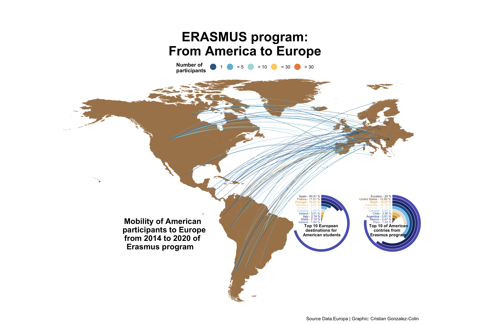

# Week 10

In this week's \#tidyTuesday, I learnt:

 Markup : * Working with maps in ggplot 
          * Linking points in a plot (geom_segment, geom_curve)
          * Combine multiple plots with patchwork

